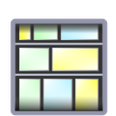
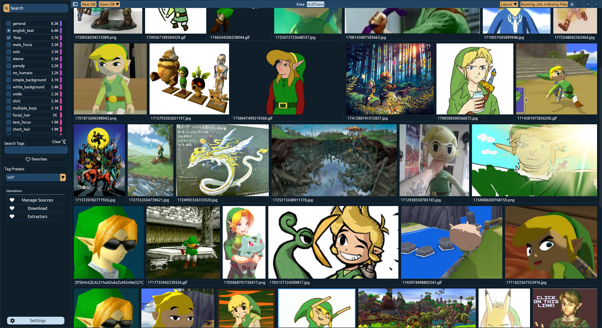
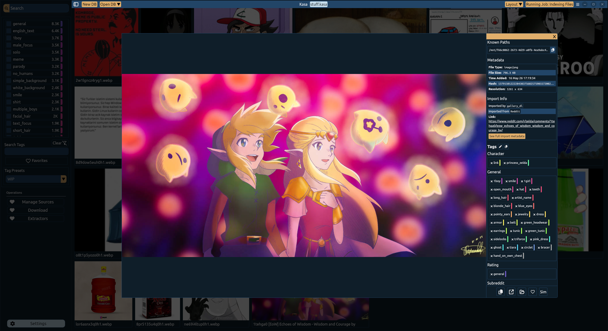
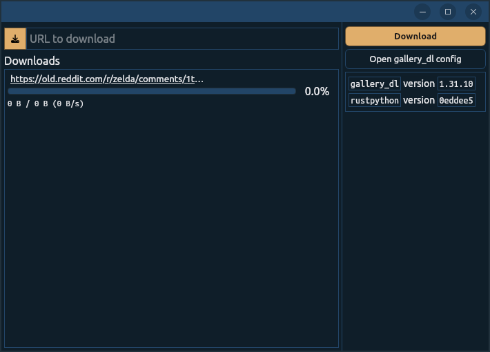

<div style="display:flex; flex-direction:column; justify-content:center; align-items:center;">

<h1 style="border:none;">Kasa</h1> 
 </img>

An app for media hoarders

</div> 





> Art from https://old.reddit.com/r/zelda/comments/1tehga0/eow_echoes_of_wisdom_wisdom_and_courage_by/



# Features
- Extremely fast indexing of media (2.3s for ~10.000 files/6Gb)
- [`gallery_dl`](https://github.com/mikf/gallery-dl) integration and tag extraction
- Local AI powered tag extraction using [Wdv Tagger](https://huggingface.co/SmilingWolf/wd-eva02-large-tagger-v3)
- See similar images to selected one, powered by image embeddings


# Developing / Building 
- Install the [Tauri Prerequisites](https://v2.tauri.app/start/prerequisites/) for your system
- Install the tauri cli using 
```
cargo install tauri-cli --version "^2.0.0" --locked
```
- Install [Bun](bun.com) then install the npm packages using 
```
bun i
```
Then run `cargo tauri dev` to run the dev server or `cargo tauri build` to build the release binaries 

# License
[GPLv3](./LICENSE.txt)